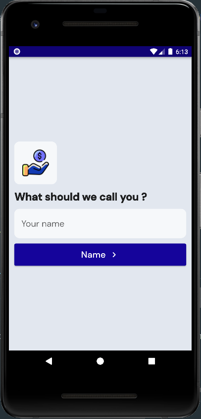
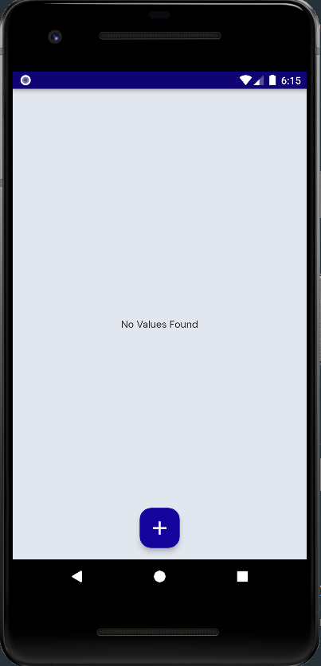
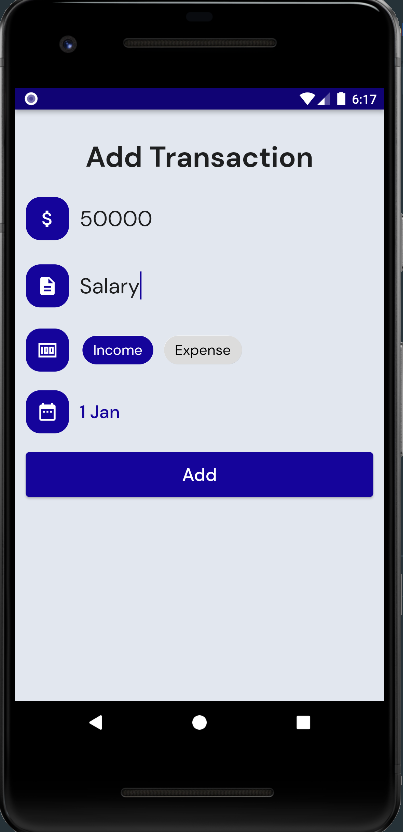
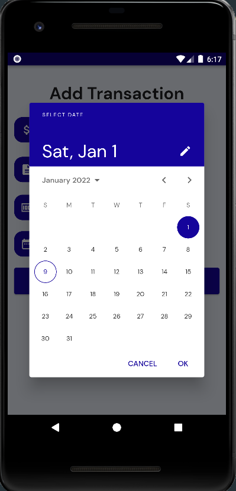
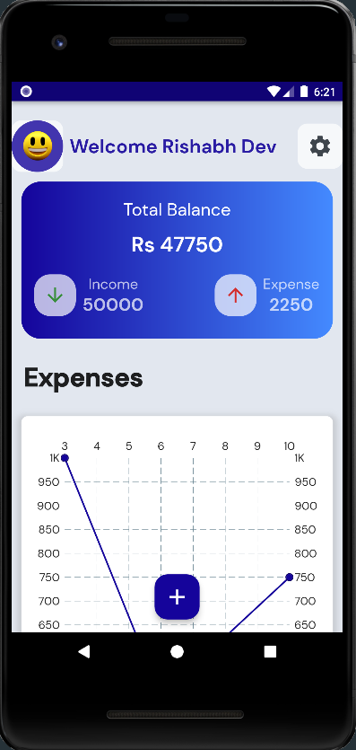
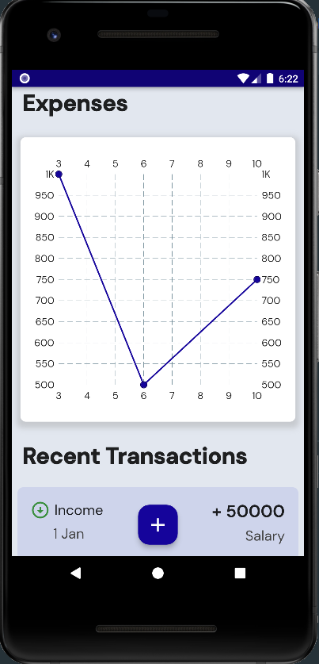
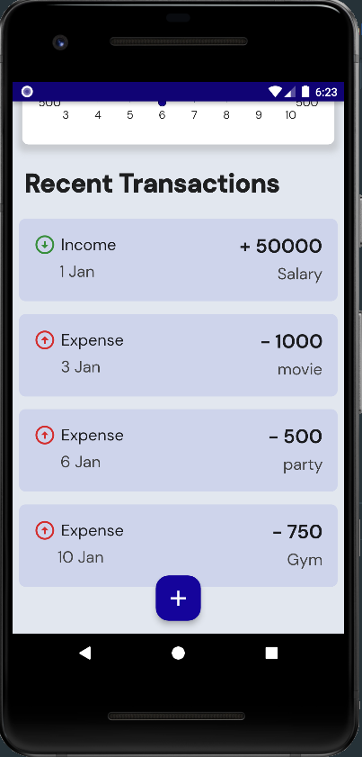

# Expense Manager

This app helps you to manage your Income and Expense. It is coded in flutter, dart. I have used Hive database to store data. This app also shows the chart of your recent expenses.

# Screeshots

### HomeScreen 

### HomePage 

### Add Transaction 

### Calender 

### HomeScreen with data 

### Expense Chart 

### Transactions 

